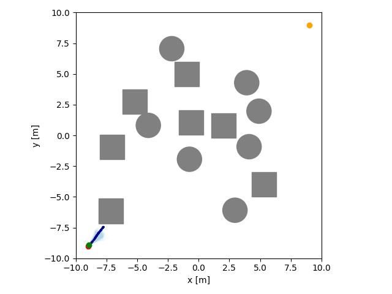

# MPPI Playground

This repository contains an implementation of [Model Predictive Path Integral Control (MPPI)](https://arxiv.org/abs/1707.02342) with PyTorch to accelerate computations on the GPU.


## Tested Environment

- Ubuntu 22.04 or higher
- GPU with NVIDIA Driver (510 or later, tested with 550) or CPU only
- [uv](https://docs.astral.sh/uv/getting-started/installation/)

## Run Examples

To run the example applications, install with additional dependencies:

```bash
# Clone repository
git clone https://github.com/kohonda/mppi_playground.git
cd mppi_playground
# Install with extra dependencies for examples
uv sync --extra example

# uv run pre-commit install  # (optional) install pre-commit hooks for code formatting
# uv run pre-commit run --all-files  # (optional) format code
```

### Navigation 2D

```bash
uv run python example/navigation2d.py
```

<p align="center">
  
</p>

### Racing

```bash
uv run python example/racing.py
```

<p align="center">
  
</p>

[circuit course information (Japan Automotive AI Challenge 2024)](https://github.com/AutomotiveAIChallenge/aichallenge-2024)

### Pendulum

```bash
uv run python example/pendulum.py
```

<p align="center">
  
</p>

### Cartpole

```bash
uv run python example/cartpole.py
```

<p align="center">
  
</p>

### Mountain car

```bash
uv run python example/mountaincar.py
```

<p align="center">
  
</p>

## Docker

<details>
<summary>Docker Setup</summary>

### Install Docker

[Installation guide](https://docs.docker.com/engine/install/ubuntu/#install-using-the-repository)

```bash
# Install from get.docker.com
curl -fsSL https://get.docker.com -o get-docker.sh
sudo sh get-docker.sh
sudo groupadd docker
sudo usermod -aG docker $USER
```

### Setup GPU for Docker

[Installation guide](https://docs.nvidia.com/datacenter/cloud-native/container-toolkit/latest/install-guide.html)

```bash
curl -fsSL https://nvidia.github.io/libnvidia-container/gpgkey | sudo gpg --dearmor -o /usr/share/keyrings/nvidia-container-toolkit-keyring.gpg \
  && curl -s -L https://nvidia.github.io/libnvidia-container/stable/deb/nvidia-container-toolkit.list | \
    sed 's#deb https://#deb [signed-by=/usr/share/keyrings/nvidia-container-toolkit-keyring.gpg] https://#g' | \
    sudo tee /etc/apt/sources.list.d/nvidia-container-toolkit.list

sudo apt-get update

sudo apt-get install -y nvidia-container-toolkit nvidia-container-runtime

sudo nvidia-ctk runtime configure --runtime=docker

sudo systemctl restart docker
```

</details>

### Build and Run

```bash
# Build container with GPU support
make build-gpu

# Open remote container via VSCode (Recommended)
# 1. Open the folder using VSCode
# 2. Ctrl+P and select 'devcontainer rebuild and reopen in container'

# Or run container via terminal
make bash-gpu
```

### Minimal Usage Example

```python
import torch
from mppi_playground import MPPI

# Define dynamics function (batch processing: state [N, dim_state], action [N, dim_control])
def dynamics(state: torch.Tensor, action: torch.Tensor) -> torch.Tensor:
    # Example: simple integrator
    next_state = state + action
    return next_state

# Define cost function (batch processing)
def cost_func(state: torch.Tensor, action: torch.Tensor, info: dict) -> torch.Tensor:
    # Example: distance to goal
    goal = torch.tensor([1.0, 1.0], device=state.device)
    return torch.sum((state - goal) ** 2, dim=1)

# Create MPPI controller
controller = MPPI(
    horizon=50,
    num_samples=1000,
    dim_state=2,
    dim_control=2,
    dynamics=dynamics,
    cost_func=cost_func,
    u_min=torch.tensor([-1.0, -1.0]),
    u_max=torch.tensor([1.0, 1.0]),
    sigmas=torch.tensor([0.5, 0.5]),
    lambda_=1.0,
)

# Solve for optimal action sequence
current_state = torch.tensor([0.0, 0.0])
action_seq, state_seq = controller(current_state)
print(f"Optimal first action: {action_seq[0]}")
```

## Citation

If you use this repo in your work, please cite this paper (https://arxiv.org/abs/2511.08019) as:

```
@article{honda2025model,
  title={Model Predictive Control via Probabilistic Inference: A Tutorial},
  author={Honda, Kohei},
  journal={arXiv preprint arXiv:2511.08019},
  year={2025}
}
```
